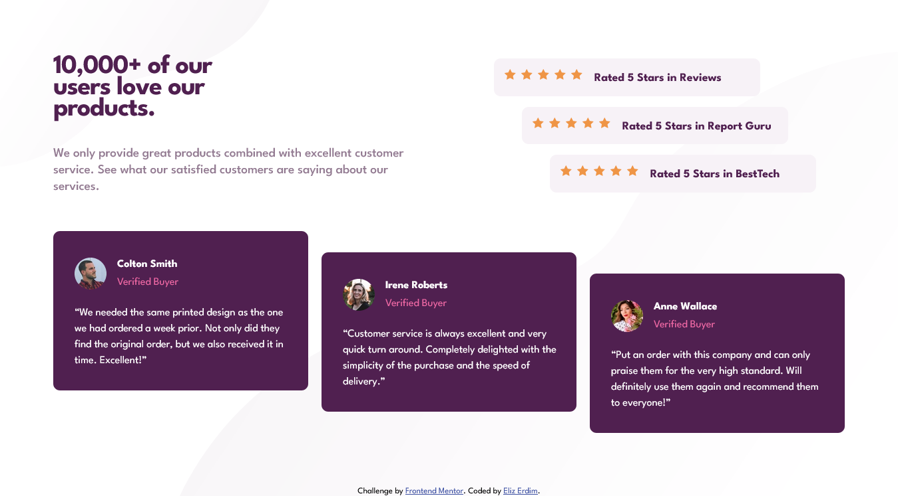

# Frontend Mentor - Social proof section solution

This is a solution to the [Social proof section challenge on Frontend Mentor](https://www.frontendmentor.io/challenges/social-proof-section-6e0qTv_bA). 

## Table of contents

- [Overview](#overview)
  - [The challenge](#the-challenge)
  - [Screenshot](#screenshot)
  - [Links](#links)
- [My process](#my-process)
  - [Built with](#built-with)
  - [What I learned](#what-i-learned)
  - [Continued development](#continued-development)
  - [Useful resources](#useful-resources)

## Overview

### The challenge

Users should be able to:

- View the optimal layout for the section depending on their device's screen size
- Read the content when they choose bigger font sizes in browser settings

### Screenshot



### Links

- [View Code](https://github.com/elizerdim/social-proof-section)
- [Live Preview](https://elizerdim.github.io/social-proof-section/)

## My process

### Built with

- Semantic HTML5 markup
- CSS custom properties
- Flexbox
- CSS Grid
- Mobile-first workflow

### What I learned

- &lt;use&gt; element
- viewBox attribute of SVG elements in HTML
- Combining Grid with Flexbox
- How to use min-height and height properties together

In this project, I really wanted to make the content still readable and look proper when the font size is set to bigger values through browser settings, while making the layout the same as the design at default font size. First of all, I knew there had to be a better way than copy-pasting the same SVG element over and over again for the stars, so I discovered the &lt;use&gt; element. Then I learned about the viewBox attribute and a bunch of other things about SVGs. I used what I learned to make the stars in the ratings section to be responsive to different font sizes. 

Combining Grid with Flexbox, getting all the boxes in the testimonials section to be the same height, and have them grow bigger to make the content still visible in bigger font sizes turned out to be quite the challenge. At first, I used the following code: 

```css
.social-proof__testimonials article {
    ...
    min-height: min-content;
    height: 341px;
}
```

It took more time of trial-error and research than I am willing to admit to figure it out, but I finally found a StackOverflow entry (linked in Useful resources section below) that suggested swapping the values, and it finally worked when I wrote the following: 

```css
.social-proof__testimonials article {
    ...
    height: min-content;
    min-height: 341px;
}
```

The layout does break at bigger font sizes such as 150% or 200%, but at least it still looks proper and the content is still readable.

### Continued development

I want to do more projects where I combine Grid and Flexbox and really master these technologies. I also want to do more projects using JavaScript in addition to CSS and become more proficient in adding functionality to my projects.

### Useful resources

- [&lt;use&gt; element](https://developer.mozilla.org/en-US/docs/Web/SVG/Element/use) - Reference for &lg;use&gt; element
- [Kevin Powell's SVG tutorials](https://www.youtube.com/playlist?list=PL4-IK0AVhVjP0EeV513_b30lhGRTfMbYd) - Amazing tutorial series for using SVGs with HTML and CSS 
- [min-content value for min-height vs. height](https://stackoverflow.com/questions/65336892/min-height-min-content-not-work-in-chrome-and-firefox) - This entry helped me figure out that min-height does not override height value when it is set to min-content.